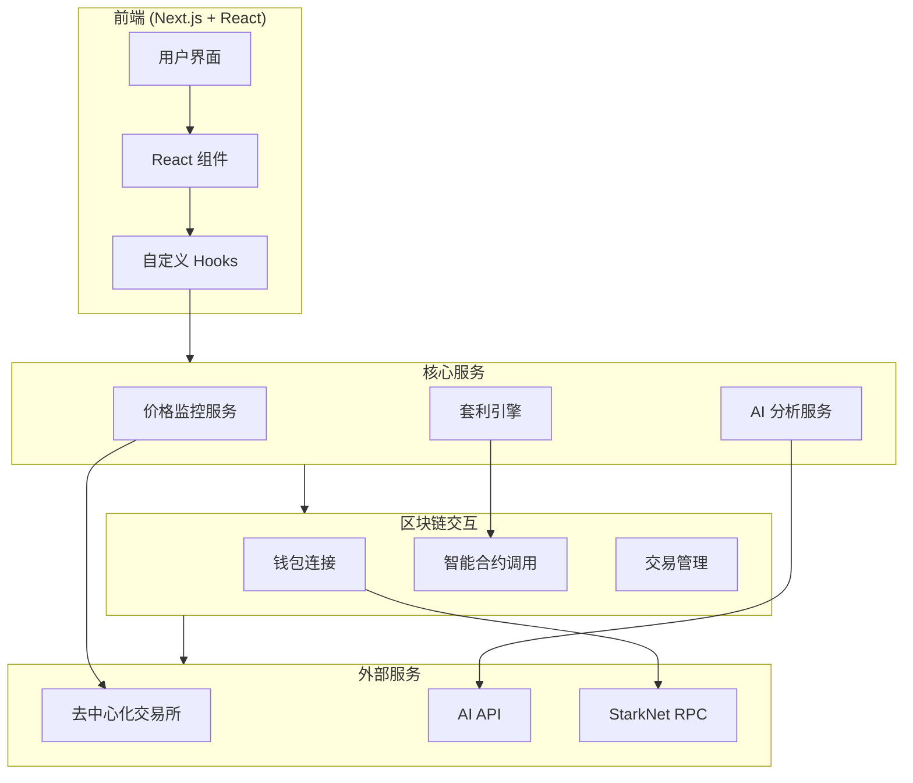

# StarArb - StarkNet 跨协议套利系统架构

## 系统架构图

## 主要组件说明

### 1. 前端层
- **用户界面 (UI)**
  - 基于 Next.js 13 构建的现代化 Web 应用
  - 使用 Tailwind CSS 实现响应式设计
  - shadcn/ui 组件库提供一致的用户体验

- **React 组件**
  - DashboardShell: 主面板外壳组件
  - MarketOpportunities: 市场机会展示组件
  - StatusBanner: 状态信息展示组件
  - ConnectButton: 钱包连接按钮组件

- **自定义 Hooks**
  - useWallet: 钱包管理
  - useArbitrage: 套利操作管理
  - useAIAnalysis: AI 分析功能
  - usePriceMonitor: 价格监控

### 2. 核心服务层
- **价格监控服务**
  - 实时监控多个 DEX 的价格数据
  - 计算跨协议价格差
  - 发现套利机会

- **套利引擎**
  - 套利策略实现
  - 利润计算
  - 风险评估
  - 交易路径优化

- **AI 分析服务**
  - 套利机会分析
  - 风险评估
  - 策略建议
  - 市场趋势分析

### 3. 区块链交互层
- **钱包连接**
  - 支持多种 StarkNet 钱包
  - 账户管理
  - 余额查询

- **智能合约调用**
  - ERC20 代币操作
  - DEX 交互
  - 闪电贷操作

- **交易管理**
  - 交易构建
  - Gas 估算
  - 交易确认
  - 失败处理

### 4. 外部服务
- **去中心化交易所**
  - JediSwap
  - MySwap
  - Avnu
  - Ekubo

- **AI API**
  - DeepSeek AI 服务
  - 套利分析 API

- **StarkNet RPC**
  - Blast API
  - 区块链数据查询
  - 合约交互

## 技术栈

### 前端
- Next.js 13
- React 18
- TypeScript
- Tailwind CSS
- shadcn/ui
- Zustand

### 区块链
- StarkNet.js
- get-starknet
- Web3 工具库

### 后端服务
- Node.js
- OpenAI/DeepSeek API
- WebSocket

### 开发工具
- pnpm
- ESLint
- Prettier
- Git

## 安全考虑

1. **钱包安全**
   - 私钥永不离开用户设备
   - 所有交易需用户确认

2. **交易安全**
   - 多重检查机制
   - 失败自动回滚
   - Gas 限制保护

3. **数据安全**
   - HTTPS 加密
   - 环境变量管理
   - API 密钥保护

4. **代码安全**
   - 代码审计
   - 依赖检查
   - 定期更新
